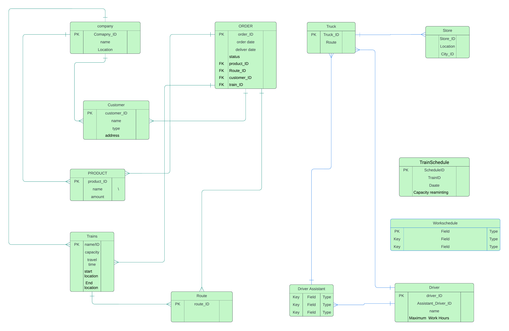

# Supply Chain Management System

## Overview

This project is a database-driven Supply Chain Management System with a front-end interface designed for managers and customers. The application is built to streamline the supply chain process by providing tailored functionalities for different types of managers, including analytical, delivery, and one other yet to be defined.

## Project Features

- **Manager Interface:**
  - **Analytical Manager:** Provides insights and reports based on supply chain data to facilitate decision-making.
  - **Delivery Manager:** Manages and tracks delivery schedules, ensuring timely delivery of goods.
  - **Rainlway Manager:** Manages train schedule to optimese delivary.

- **Customer Interface:**
  - Allows customers to track orders, view delivery statuses, and access relevant information about their purchases.

## Technology Stack

- **Backend:** Node.js with express
- **Database:** MySQL
- **Frontend:** Angular

## Database Design

The core of this project is the database, which is meticulously designed to handle the complexities of supply chain management. 




## Installation

1. Clone the repository:
   ```bash
   git clone https://github.com/rashmirathnayake/Supply-Chain-Management-System
   ```
2. Navigate to the project directory:

```bash

cd supply-chain-management-system
```
3. Install dependencies:

```bash

npm install
```
4. Set up the database:

- Set up a new Mysql database and run the quary in the file database.txt

5. Run the application:

```bash

    cd back-end/supplychain
    node server.js
    # in another terminal
    cd front-end/SUPPLY CHAIN MANAGEMENT SYSTEM
    ng serve
```

# Usage

Once the application is up and running, managers can log in to access their respective dashboards. Customers can also log in or register to view and track their orders.
Contributing


